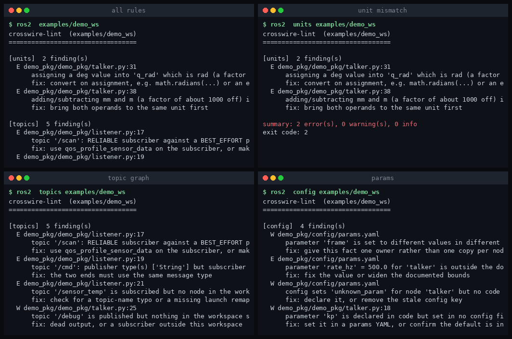
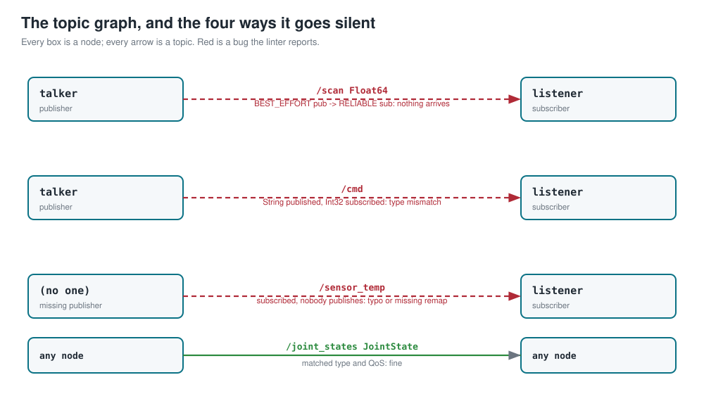
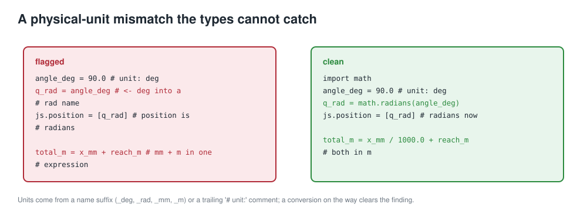

# CrossWire



*Four commands of the CLI.*

**Catch the cheap-to-detect ROS 2 bug classes before they cost you a lab day: physical-unit mismatches, cross-node interaction bugs, parameter misconfiguration, missing dependencies, and service contracts with no server.**

A static linter (with an optional live-graph cross-check) for a ROS 2 workspace. It reads your source, launch and config files, builds a model of the system, and reports the mistakes that compile fine, type-check fine, and then move the robot to the wrong place or leave a panel silently blank.

```
$ ros2-lint examples/demo_ws

[units]  2 finding(s)
  E demo_pkg/demo_pkg/talker.py:31
      assigning a deg value into 'q_rad' which is rad (a factor of about 57 off) with no conversion   (units.deg-into-rad)
  E demo_pkg/demo_pkg/talker.py:38
      adding/subtracting mm and m (a factor of about 1000 off) in one expression   (units.mixed-scale-arithmetic)

[topics]  5 finding(s)
  E demo_pkg/demo_pkg/listener.py:17
      topic '/scan': RELIABLE subscriber against a BEST_EFFORT publisher -- DDS delivers nothing   (topics.qos-incompatible)
  E demo_pkg/demo_pkg/listener.py:19
      topic '/cmd': publisher type(s) ['String'] but subscriber type(s) ['Int32']   (topics.type-mismatch)
  ...
summary: 10 error(s), 6 warning(s), 0 info
exit code: 10
```

Python 3.10+, standard library plus PyYAML. No ROS installation is needed to run the static checks, so it drops straight into CI.

## The problem

The 2026 ACM Computing Surveys paper *"ROS 2 in a Nutshell"* and the software-engineering literature (ICSE / ISSTA / FSE) keep flagging the same thing: misconfigurations, physical-unit mismatches, dependency bugs and inter-component **interaction bugs** in ROS remain empirically common, with only partial tooling to catch them. Formal methods stay hard to apply in practice because building the models and extracting the system parameters by hand is expensive. And ROS 2's added abstractions raise the learning curve, so the same mistakes recur as people migrate.

This tool takes the pragmatic middle path: it does **not** try to prove a system correct. It catches the common, cheap-to-detect classes with a light static model plus an optional live cross-check, and names each finding in plain words with a fix.



*The topic graph the linter builds, and the four ways it reports a graph that is up and silent: a QoS mismatch, a type mismatch, a subscription with no publisher, and (a warning) an output nobody reads.*

## What it catches

| group | rule | severity |
|---|---|---|
| **units** | a `_deg` value assigned into a `_rad` field (or mm into m) with no conversion; arithmetic mixing scales or dimensions; a differently-united value into a known message field | error / warning |
| **topics** | RELIABLE subscriber vs BEST_EFFORT publisher (the commonest silent-delivery bug); publisher/subscriber message-type mismatch; a subscribed topic nobody publishes; a published topic nobody reads | error / warning |
| **config** | a parameter declared in code but set in no config; a config key never declared; a value outside documented `[min, max]` bounds; the same parameter set to different values in two places | error / warning |
| **deps** | a ROS package imported but not declared in `package.xml`; a declared depend nothing imports | error / warning |
| **interfaces** | a service or action client with no matching server anywhere in the workspace | error |



*The flagship check. Units come from a name suffix or a trailing `# unit:` comment, and a recognised conversion on the way clears the finding.*

**What it does not do.** It is a linter, not a proof. It reasons about static structure and a graph snapshot; it gives no real-time, scheduling, or end-to-end correctness guarantees, and it deliberately stays conservative (a false alarm is worse than silence for a tool people are meant to keep switched on). Dynamic topic names, values that flow through indirection it cannot follow, and C++-only nodes are outside its reach.

## Install

```
pip install git+https://github.com/megazron/crosswire-lint
```

## Quickstart

```
ros2-lint path/to/your_ws            # every rule
ros2-lint units path/to/src          # just the unit checks
ros2-lint --json path/to/your_ws     # machine-readable, for CI
ros2-lint selftest                   # run on the bundled demo workspace
```

Exit code is the number of ERROR findings, so a CI step gates on it directly.

## The unit convention

Annotate a value's unit in either of two no-cost ways:

- a **name suffix**: `angle_deg`, `q_rad`, `span_mm`, `reach_m`, `speed_mps`, `rate_dps`;
- a **trailing comment**: `x = read_sensor()  # unit: rad`.

Known ROS message fields carry their units built in (`sensor_msgs/JointState.position` is radians, `geometry_msgs/Twist.linear` is m/s, and so on). Extend or override them, and declare parameter bounds, in a `lint.yaml`:

```yaml
units:
  "*.temperature": c
  "MyMsg.range_mm": mm
param_bounds:
  rate_hz: [1.0, 100.0]
exclude:
  - "**/vendor/**"
min_severity: warning
```

A conversion on the way out clears the finding: `math.radians(...)`, `deg2rad(...)`, `* DEG2RAD`, `/ 1000.0`, or an explicit `# unit:` re-annotation on the line.

## Live cross-check

```
ros2-lint live path/to/your_ws
```

With a ROS 2 graph running, this snapshots it with the `ros2` CLI (it never imports rclpy) and cross-checks it against the static model: a topic your code publishes that is **not** on the live graph means the node is not running or crashed before it advertised; a type or QoS mismatch can be confirmed against the metal. Without `ros2` on `PATH` it reports one SKIP finding and the static run still stands.

## CI usage

```yaml
- run: pip install git+https://github.com/megazron/crosswire-lint
- run: ros2-lint src   # non-zero exit fails the job on any error-severity finding
```

Use `--severity warning` to fail on warnings too, or `--json` to feed another tool.

## Limitations

- Static analysis over Python source; C++ nodes are parsed only for `package.xml` deps, not for their topic graph.
- QoS is classified only when it is a recognised profile, an integer depth, or an explicit `reliability=`; otherwise it is left unknown and no QoS finding is raised.
- The unit checker follows names and simple expressions, not values through arbitrary call chains.
- The live cross-check reflects one instant of one graph.

## Figures

Every figure in `docs/img/` is regenerated by `python3 docs/make_figures.py`.

## License

MIT, © 2026 Gaus Mohiuddin Sayyad.
